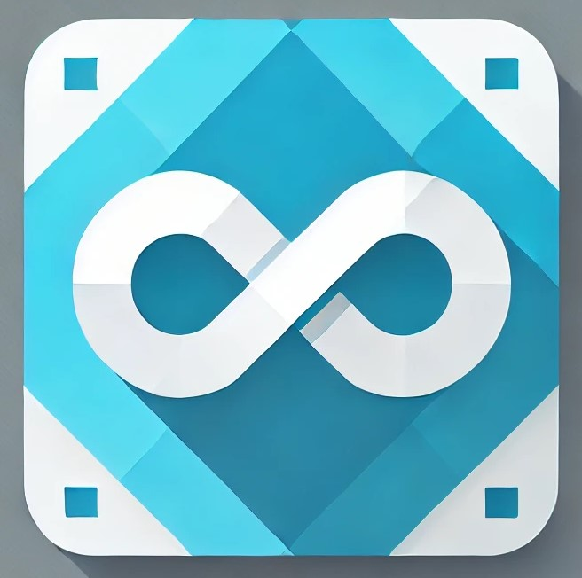

# Azure Storage Queue Service library



[](https://github.com/jasonshave/JasonShave.AzureStorage.QueueService/actions/workflows/dotnet.yml)
[](https://github.com/jasonshave/JasonShave.AzureStorage.QueueService/actions/workflows/nuget.yml)

This project abstracts away the complexities of using the Azure Storage account's queue feature targeting .NET 6 and higher.

## Pre-requisites

You will need to create an Azure Storage account in the Azure portal using a unique name, then create a queue, and finally obtain your connection string.

1. [Create a storage account](https://docs.microsoft.com/en-us/azure/storage/common/storage-account-create?tabs=azure-portal) in your Azure portal.
2. [Obtain your connection string](https://docs.microsoft.com/en-us/azure/storage/common/storage-account-keys-manage?tabs=azure-portal) from the Azure portal.

## Message handling behavior

- Sending a message will automatically serialize the payload to `BinaryData`.
- By default one message is pulled when `ReceiveMessagesAsync<T>` is called, however this is configurable.
- If your handler does not throw, messages are automatically removed from the queue otherwise the message is returned to the queue for delivery again.
- Automatic deserialization uses the `System.Text.Json` deserialization behavior. This can be overridden by specifying your own `JsonSerializerOptions` as seen below.
- You can 'peek' messages using `PeekMessages<T>` which returns a collection but doesn't remove them from the queue.

## Configuration

1. Add the Nuget package `JasonShave.AzureStorage.QueueService` to your .NET project
2. Set your `ConnectionString` and `QueueName` properties in your [.NET User Secrets store](https://docs.microsoft.com/en-us/aspnet/core/security/app-secrets?view=aspnetcore-6.0&tabs=windows), `appsettings.json`, or anywhere your `IConfiguration` provider can look for the `QueueClientSettings`. For example:

    ```json
    {
        "QueueClientSettings" : {
            "ConnectionString": "[your_connection_string]",
            "QueueName": "[your_queue_name]",
            "CreateIfNotExists": true
        }
    }
    ```

    or set the endpoint URI which inclues the queue name and use a Token Credential during startup:

   ```json
   {
       "QueueClientSettings": {
           "EndpointUri": "https://somestorageaccount.queue.corewindows.net/myqueuename",           
       }
   }
   ```

   ```csharp
   services.AddAzureStorageQueueClient(x => 
    x.AddDefaultClient(y => 
    {
        y.EndpointUri = new Uri(builder.Configuration["SomeKey:EndpointUri"]),
        y.TokenCredential = new DefaultAzureCredential(),
    }));
   ```

4. You can create your queue in advance or allow the library to create it during runtime by setting the `CreateIfNotExists` property to `true`.

## Configure dependency injection

The library has been updated to handle both a default client and a named-client experience similar to how the .NET `IHttpClientFactory` works. This section outlines both ways you can configure dependency injection to either use the default client or a named client in case you have more than one queue to pull from.

### Add the default client

Use the `AddAzureStorageQueueClient()` method and specify the settings for the `ConnectionString` and the `QueueName` or use the `IConfiguration` binder to bind with a JSON configuration as shown above.

```csharp
services.AddAzureStorageQueueClient(x => 
    x.AddDefaultClient(y => 
    {
        y.ConnectionString = "[your_connection_string]";
        y.QueueName = "[your_queue_name]";    
    }));
```

```csharp
// get configuration from IConfiguration binder
services.AddAzureStorageQueueClient(x => 
    x.AddDefaultClient(y => Configuration.Bind(nameof(QueueClientSettings), y)));
```

### Add a named client

Use the `AddAzureStorageQueueClient()` method with the `AddClient()` method to add and configure different queue clients which can be obtained using the `IQueueClientFactory` and the `GetQueueClient()` method.

```csharp
services.AddAzureStorageQueueClient(x => 
    x.AddClient("MyClient1", y => 
    {
        y.ConnectionString = "[your_connection_string]";
        y.QueueName = "[your_queue_name]";    
    }));
```

```csharp
// get configuration from IConfiguration binder
services.AddAzureStorageQueueClient(x => 
    x.AddClient("MyClient1", y => Configuration.Bind(nameof(QueueClientSettings), y)));
```

```csharp
// add multiple named clients and a default client
services.AddAzureStorageQueueClient(x =>
{
    x.AddClient("MyClient1", y => Configuration.Bind(nameof(QueueClientSettings), y));
    x.AddClient("MyClient2", y =>
    {
        y.ConnectionString = "[your_connection_string]";
        y.QueueName = "[your_queue_name]";
    });
    x.AddDefaultClient(y => Configuration.Bind(nameof(DefaultQueueClientSettings), y));
});
```

## Using the IQueueClientFactory

### Example 1: Get a default queue client

```csharp
// inject the IQueueClientFactory and get a default client
public class MyClass
{
    private readonly AzureStorageQueueClient _queueClient;

    public MyClass(IQueueClientFactory queueClientFactory)
    {
        _queueClient = queueClientFactory.GetQueueClient();
    }
}
```

### Example 2: Get a named client

```csharp
// inject the IQueueClientFactory and get a default client
public class MyClass
{
    private readonly AzureStorageQueueClient _queueClient;

    public MyClass(IQueueClientFactory queueClientFactory)
    {
        _queueClient = queueClientFactory.GetQueueClient("MyClient1");
    }
}
```

## Sending messages to an Azure storage account queue

The following example shows the .NET Worker Service template where the class uses the `IHostedService` interface to send a message every five seconds.

1. Inject the `IQueueClientFactory` interface and use as follows:

    ```csharp
    public class Sender : IHostedService
    {
        private readonly AzureStorageQueueClient _queueClient;
        
        public Sender(IQueueClientFactory queueClientFactory) => _queueClient = queueClientFactory.GetQueueClient();
        
        public async Task StartAsync(CancellationToken cancellationToken)
        {
            while (!cancellationToken.IsCancellationRequested)
            {
                var myMessage = new MyMessage("Test");
                await _queueClient.SendMessageAsync<MyMessage>(myMessage, cancellationToken);
                await Task.Delay(5000);
            }
        }    
    }
    ```

## Receiving and handling messages from an Azure storage account queue

The following example shows the .NET Worker Service template where the class uses the `IHostedService` interface to run a particular code block repeatedly. The application will receive the payload from the queue repeatedly.

1. Inject the `IQueueClientFactory` interface and use as follows:

    ```csharp
    public class MySubscriber : IHostedService
    {
        private readonly AzureStorageQueueClient _queueClient;
        private readonly IMyMessageHandler _myMessageHandler; // see optional handler below
    
        public MySubscriber(IQueueClientFactory queueClientFactory, IMyMessageHandler myMessageHandler)
        {
            // get the default queue client
            _queueClient = queueClientFactory.GetQueueClient();
            _myMessageHandler = myMessageHandler;
        }
            
        public async Task StartAsync(CancellationToken cancellationToken)
        {
            while (!cancellationToken.IsCancellationRequested)
            {
                await _queueClient.ReceiveMessagesAsync<MyMessage>(
                    message => _myMessageHandler.HandleAsync(message),
                    exception => _myMessageHandler.HandleExceptionAsync(exception),
                    cancellationToken);
                await Task.Delay(1000);
            }
        }
    }
    ```

### Handling multiple messages

The library allows you to pull multiple messages by specifying the `maxMessage` count as an integer in the `ReceiveMessagesAsync<T>()` method. These are sent to the handler as individual messages but pulled from the queue as a batch the consuming application would hold a lock on for the default duration used in the Azure Storage Queue library.

```csharp
await _queueClient.ReceiveMessagesAsync<MyMessage>(HandleMessage, HandleException, cancellationToken, 10);
```

## OpenTelemetry Support

The library supports OpenTelemetry logs, traces, and metrics and can be configured using the standard OTEL library as follows:

```csharp
builder.Services.AddOpenTelemetry()
  .WithTracing(t => t.AddAzureStorageQueueTracing())
  .WithMetrics(m => m.AddAzureStorageQueueMetrics());
```

The library inclues two flags to control traces for sending messages and the creation of an Activity (span) for each query to retrieve a message. These two activities are:
- Queue.Read
- Queue.Send

>NOTE: To observe the above spans, you need to configure the library to create them. Be cautious on enabling the `Queue.Read` span though as it creates a lot of data in your telemetry system; particularly if you read with a high frequency (i.e. every 1 second, etc.).

```csharp
builder.Services.ConfigureQueueServiceTelemetry(t =>
{
  t.CreateNewActivityOnMessageRetrieval = true; // Queue.Read trace
  t.CreateNewActivityOnMessageSend = true; // Queue.Send trace
});
```

The following metrics have also been configured and read through tools like Azure Monitor or Grafana:
- `queue_messages_received_total`
- `queue_messages_sent_total`
- `queue_messages_processed_total`
- `queue_message_processing_duration_seconds`

## License

This project is licensed under the MIT License - see the [LICENSE.md](license.md) file for details.
